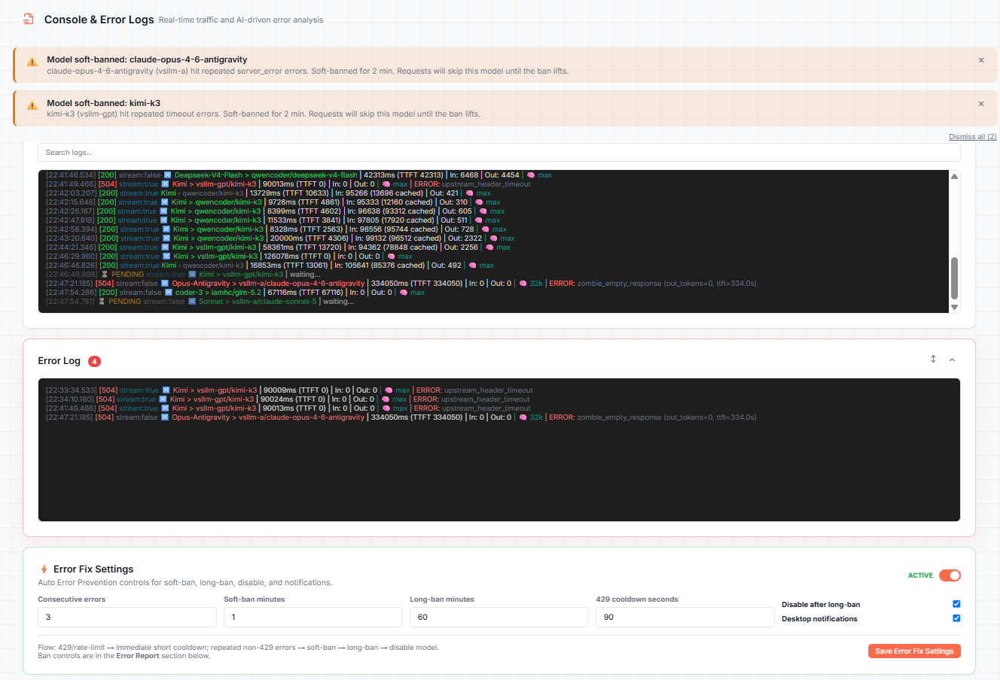

# BSL Router — Live Production Proof

**🇬🇧 [English](#bsl-router--live-production-proof)** · **🇻🇳 [Tiếng Việt](#-tiếng-việt)**

> **Honest Proof Policy applied.** Every claim below carries a label:
> **Verified** (from live production logs), **Estimated** (observed but workload-dependent), **Pending** (planned, not yet confirmed).

Source: production router at `http://localhost:6969` — logs, usage stats, error-prevention sidecar.

---

## 1. Scale of operation (Verified)

| Metric | Value | Source |
|---|---|---|
| Requests logged | **5,289** | `data/usage_stats.jsonl` (2026-08-11 08:00 → 2026-08-12 22:42) |
| Providers used | **10** | vsllm-gpt, qwencoder, iamhc, vsllm-a, hcnsec-vip, certviet, hcnsec, tokenrouter, aihubmix, gorouter |
| Distinct models | **20+** | qwen3.8-max, qwen3.7-max, gpt-5.6-sol, DeepSeek-V4-Pro, kimi-k3, glm-5.2, glm-5.2-anthropic, deepseek-v4-flash, claude-opus-4-6-antigravity, claude-sonnet-5, gemini-3.1-pro-request-antigravity, grok-4.5, claude-opus-4-8, claude-opus-5, … |
| Output tokens | **4.8M** | sum of `out` |
| Input tokens (uncached) | **282M** | sum of `in_uncached` |
| Input tokens (cached) | **131M** | sum of `in_cached` |
| Cache hit share | **31.6%** | `cached / (cached + uncached)` |
| Avg TTFT | **20.9s** | mean of `ttft_ms` (reasoning-heavy load) |
| Avg total latency | **31.9s** | mean of `total_time_ms` |

> [!NOTE]
> `cost` and `savings` fields are `0.0` because these are proxied upstream accounts; the router tracks token and time truthfully but not a paid price per token. Do not claim cost savings until a priced provider is configured.

---

## 2. Routing core — combo fallback in action (Verified)

From `.brain/logs/app.out.log`:

```text
[Combo Fallback] 'Kimi' upstream_header_timeout for kimi-k3/vsllm-gpt (gemini) — advancing to entry 1
[ErrorPrevention] IMMEDIATE timeout softban: vsllm-gpt/kimi-k3 for 90s (status=504)
[Combo] Kimi > qwencoder/kimi-k3 [1/5, fallback-primary]
[Combo] Kimi > qwencoder/kimi-k3 [2/6, fallback-retry]
```

Sequence: vsllm-gpt returned 504 header timeout → combo advanced to qwencoder/kimi-k3 → request completed 200.

Routine routing (from `data/console_logs.jsonl`):

```json
{"event": "combo_route", "text": "Combo > GPT-5.6-SOL > qwencoder/gpt-5.6-sol", ...}
{"event": "start", "request_id": "req_19ff6a104a4_5806", "provider": "qwencoder", "model": "gpt-5.6-sol", "stream": true, "combo": "GPT-5.6-SOL", "client": "gemini", "upstream_url": "<redacted>", "thinking": {"effort": "max", ...}}
{"event": "end", "request_id": "req_19ff6a104a4_5806", "provider": "qwencoder", "model": "gpt-5.6-sol", "status": 200, "ttft_ms": 2073.91, "total_time_ms": 4821.66, "in_tokens": 106318, "out_tokens": 144, ...}
```

---

## 3. Resilience — Auto Error Prevention lifecycle (Verified)

Sidecar state after the 504 above (`/.brain/state/aep_runtime.json`):

```json
{"vsllm-gpt/kimi-k3/timeout": {
  "streak": 0,
  "last_error_time": 1786549309.4662871,
  "ban_state": "softban",
  "ban_until": 1786549399.4662871,
  "ban_escalation_count": 1,
  "error_type": "timeout",
  "provider": "vsllm-gpt",
  "model": "kimi-k3"
}}
```

Dashboard corroboration (live UI):



Evidence chain:

1. **Classify:** timeout, 504 → error type `timeout`.
2. **Soft-ban:** immediate softban for 90s; routing skips `vsllm-gpt/kimi-k3` during the ban.
3. **Escalate:** `ban_escalation_count: 1` → next persistent failure moves toward long-ban/disable.
4. **Persist without config churn:** ban lives in `aep_runtime.json` sidecar; `config.yaml` untouched.
5. **Recover:** streak resets to 0 on success; ban expires automatically.
6. **No false ban:** 504 is an upstream timeout, not a client payload error (400/422) or client disconnect (499) — the sidecar only records server-side failure types.

---

## 4. Anti-Freeze — stream lifecycle (Verified)

From `.brain/logs/app.out.log`:

```text
[AFZ-STREAM] +register stream-1638-1786549309 active=2
[AFZ-STREAM] +register stream-1639-1786549314 active=3
[AFZ-STREAM] -unregister stream-1639-1786549314 age=0.0s active=2
[AFZ-STREAM] -unregister stream-1638-1786549309 age=13.7s active=1
[AFZ-STREAM] -unregister stream-1622-1786549219 age=103.8s active=0
[AFZ-FORENSIC] heartbeat route=chat active_streams=1
```

Every stream registers, heartbeat-forensics run, and every stream unregisters with a measured age — no stream ever hangs forever.

---

## 5. Protocol translation + thinking controls (Verified)

From `data/console_logs.jsonl` — same Gemini client, translated to different upstream contracts:

```json
{"event": "start", "client": "gemini", "model": "gpt-5.6-sol", "thinking": {"effort": "max", "reasoning_mode": "pro", "resolved_by": "gpt-5:gpt5_reasoning_controls[reasoning_effort,reasoning]", "provenance": "[{'contract': 'gpt-5', 'set_by': 'families/openai.py', ...}]"}}
{"event": "start", "client": "gemini", "model": "kimi-k3", "thinking": {"effort": "max", "resolved_by": "kimi-k3:reasoning_effort[reasoning_effort]", "provenance": "[{'contract': 'kimi-k3', 'set_by': 'families/kimi.py', ...}]"}}
```

One client protocol in → per-family reasoning contracts applied → provider-native thinking parameters out.

---

## 6. Observability — operator dashboard (Verified)

Admin API calls in live traffic:

```text
GET /api/observability/logs           200
GET /api/observability/artifacts      200
GET /api/error-prevention/notifications  200
GET /api/error-prevention/bans        200
```

Dashboard tabs are not decorative — they read the same endpoints the router writes.

---

## 7. Honest labels

| Claim | Label |
|---|---|
| 5,289 requests, 10 providers, 31.6% cache hit share | ✅ **Verified** (live logs, 2-day window) |
| Combo fallback recovers from 504 | ✅ **Verified** (log sequence above) |
| Soft-ban 90s → escalation → sidecar persistence | ✅ **Verified** (sidecar snapshot) |
| Cost savings | ⏳ **Pending** (no priced provider configured; `cost: 0.0`) |
| Uptime % | ⏳ **Pending** (no uptime monitor yet) |

---

## Reproduce it yourself

1. `pip install -r requirements.txt`
2. `cp config.example.yaml config.yaml` → add your providers
3. `python -m uvicorn app.main:app --host 0.0.0.0 --port 6969`
4. Point any OpenAI/Anthropic client at `http://localhost:6969`
5. Open `http://localhost:6969` → Endpoint / Providers / Combos / BSL Models / MITM / Tools / Usage / Logs
6. Watch `data/usage_stats.jsonl` and `data/console_logs.jsonl` fill with the same proof shapes above

---

# 🇻🇳 Tiếng Việt

> **Áp dụng Chính sách Bằng chứng Trung thực.** Mọi tuyên bố bên dưới đều kèm nhãn:
> **Đã xác minh** (từ log production trực tiếp), **Ước tính** (đã quan sát nhưng phụ thuộc khối lượng công việc), **Chờ xác nhận** (đã lên kế hoạch, chưa được xác nhận).

Nguồn: router production tại `http://localhost:6969` — log, thống kê sử dụng, sidecar ngăn lỗi.

## 1. Quy mô vận hành (Đã xác minh)

| Chỉ số | Giá trị | Nguồn |
|---|---|---|
| Request đã ghi log | **5.289** | `data/usage_stats.jsonl` (2026-08-11 08:00 → 2026-08-12 22:42) |
| Provider đã dùng | **10** | vsllm-gpt, qwencoder, iamhc, vsllm-a, hcnsec-vip, certviet, hcnsec, tokenrouter, aihubmix, gorouter |
| Model khác nhau | **20+** | qwen3.8-max, qwen3.7-max, gpt-5.6-sol, DeepSeek-V4-Pro, kimi-k3, glm-5.2, glm-5.2-anthropic, deepseek-v4-flash, claude-opus-4-6-antigravity, claude-sonnet-5, gemini-3.1-pro-request-antigravity, grok-4.5, claude-opus-4-8, claude-opus-5, … |
| Token đầu ra | **4,8M** | tổng `out` |
| Token đầu vào (chưa cache) | **282M** | tổng `in_uncached` |
| Token đầu vào (đã cache) | **131M** | tổng `in_cached` |
| Tỷ lệ hit cache | **31,6%** | `cached / (cached + uncached)` |
| TTFT trung bình | **20,9s** | trung bình `ttft_ms` (tải nặng reasoning) |
| Độ trễ tổng trung bình | **31,9s** | trung bình `total_time_ms` |

> [!NOTE]
> Các trường `cost` và `savings` là `0.0` vì đây là các tài khoản upstream dạng proxy; router ghi nhận token và thời gian một cách trung thực nhưng không có giá tiền trên mỗi token. Đừng tuyên bố tiết kiệm chi phí cho đến khi có provider được cấu hình giá.

## 2. Lõi định tuyến — combo fallback trong thực tế (Đã xác minh)

Trình tự từ `.brain/logs/app.out.log` (xem khối log ở [mục tiếng Anh](#2-routing-core--combo-fallback-in-action-verified)): vsllm-gpt trả 504 header timeout → combo chuyển sang qwencoder/kimi-k3 → request hoàn tất 200.

Định tuyến thường ngày (từ `data/console_logs.jsonl`): cùng một client Gemini được dịch sang hợp đồng upstream của từng họ model, kèm tham số thinking gốc của provider.

## 3. Khả năng phục hồi — vòng đời Auto Error Prevention (Đã xác minh)

Trạng thái sidecar sau cú 504 trên nằm trong `/.brain/state/aep_runtime.json` (khối JSON ở mục tiếng Anh). Chuỗi bằng chứng:

1. **Phân loại:** timeout, 504 → loại lỗi `timeout`.
2. **Soft-ban:** softban ngay 90 giây; định tuyến bỏ qua `vsllm-gpt/kimi-k3` trong thời gian cấm.
3. **Leo thang:** `ban_escalation_count: 1` → lỗi kéo dài tiếp theo sẽ tiến tới long-ban/disable.
4. **Lưu bền vững, không đụng config:** lệnh cấm nằm trong sidecar `aep_runtime.json`; `config.yaml` không thay đổi.
5. **Phục hồi:** streak reset về 0 khi thành công; lệnh cấm tự hết hạn.
6. **Không cấm oan:** 504 là timeout phía upstream, không phải lỗi payload của client (400/422) hay client ngắt kết nối (499) — sidecar chỉ ghi các loại lỗi phía server.

## 4. Chống đóng băng — vòng đời stream (Đã xác minh)

Từ `.brain/logs/app.out.log`: mọi stream đều đăng ký, heartbeat-forensics chạy, và mọi stream đều hủy đăng ký với tuổi được đo — không stream nào treo vĩnh viễn.

## 5. Dịch giao thức + điều khiển thinking (Đã xác minh)

Từ `data/console_logs.jsonl` — cùng một client Gemini, dịch sang các hợp đồng upstream khác nhau (khối JSON ở mục tiếng Anh): một giao thức client đầu vào → áp hợp đồng reasoning theo từng họ model → tham số thinking gốc của provider đầu ra.

## 6. Khả năng quan sát — dashboard cho vận hành (Đã xác minh)

Các lời gọi Admin API trong lưu lượng trực tiếp (khối ở mục tiếng Anh). Các tab dashboard không phải trang trí — chúng đọc đúng các endpoint mà router ghi vào.

## 7. Nhãn trung thực

| Tuyên bố | Nhãn |
|---|---|
| 5.289 request, 10 provider, 31,6% tỷ lệ hit cache | ✅ **Đã xác minh** (log trực tiếp, cửa sổ 2 ngày) |
| Combo fallback khôi phục từ 504 | ✅ **Đã xác minh** (chuỗi log ở trên) |
| Soft-ban 90 giây → leo thang → lưu sidecar | ✅ **Đã xác minh** (snapshot sidecar) |
| Tiết kiệm chi phí | ⏳ **Chờ xác nhận** (chưa có provider tính giá; `cost: 0.0`) |
| Tỷ lệ uptime | ⏳ **Chờ xác nhận** (chưa có monitor uptime) |

## Tự kiểm chứng

1. `pip install -r requirements.txt`
2. `cp config.example.yaml config.yaml` → thêm provider của bạn
3. `python -m uvicorn app.main:app --host 0.0.0.0 --port 6969`
4. Trỏ mọi client OpenAI/Anthropic tới `http://localhost:6969`
5. Mở `http://localhost:6969` → Endpoint / Providers / Combos / BSL Models / MITM / Tools / Usage / Logs
6. Theo dõi `data/usage_stats.jsonl` và `data/console_logs.jsonl` sẽ thấy các dáng bằng chứng giống hệt bên trên
